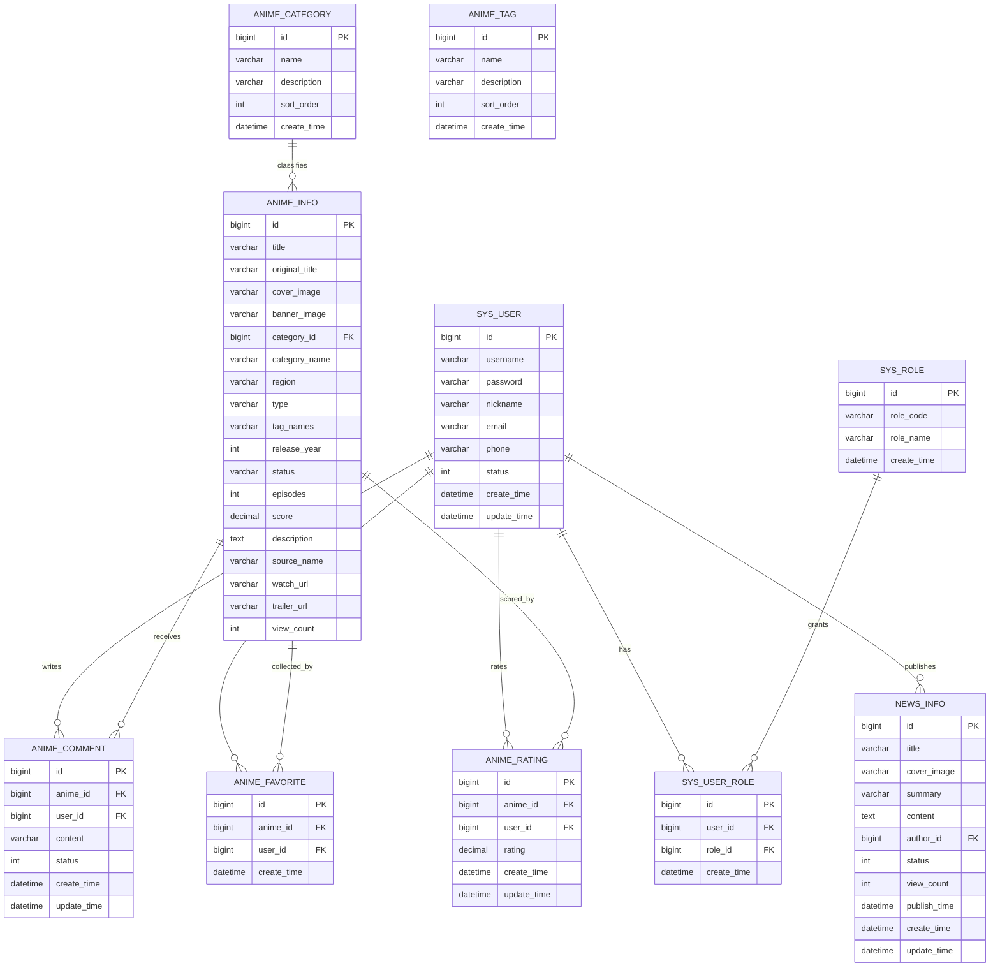

# 数据库 E-R 图

以下 Mermaid 图可直接放入论文或答辩材料中，用于说明系统核心数据表关系。

```mermaid
erDiagram
    SYS_USER {
        bigint id PK
        varchar username
        varchar password
        varchar nickname
        varchar email
        varchar phone
        int status
        datetime create_time
        datetime update_time
    }

    SYS_ROLE {
        bigint id PK
        varchar role_code
        varchar role_name
        datetime create_time
    }

    SYS_USER_ROLE {
        bigint id PK
        bigint user_id FK
        bigint role_id FK
        datetime create_time
    }

    ANIME_INFO {
        bigint id PK
        varchar title
        varchar original_title
        varchar cover_image
        varchar banner_image
        bigint category_id FK
        varchar category_name
        varchar region
        varchar type
        varchar tag_names
        int release_year
        varchar status
        int episodes
        decimal score
        text description
        varchar source_name
        varchar watch_url
        varchar trailer_url
        int view_count
    }

    ANIME_CATEGORY {
        bigint id PK
        varchar name
        varchar description
        int sort_order
        datetime create_time
    }

    ANIME_TAG {
        bigint id PK
        varchar name
        varchar description
        int sort_order
        datetime create_time
    }

    ANIME_COMMENT {
        bigint id PK
        bigint anime_id FK
        bigint user_id FK
        varchar content
        int status
        datetime create_time
        datetime update_time
    }

    ANIME_FAVORITE {
        bigint id PK
        bigint anime_id FK
        bigint user_id FK
        datetime create_time
    }

    ANIME_RATING {
        bigint id PK
        bigint anime_id FK
        bigint user_id FK
        decimal rating
        datetime create_time
        datetime update_time
    }

    NEWS_INFO {
        bigint id PK
        varchar title
        varchar cover_image
        varchar summary
        text content
        bigint author_id FK
        int status
        int view_count
        datetime publish_time
        datetime create_time
        datetime update_time
    }

    SYS_USER ||--o{ SYS_USER_ROLE : has
    SYS_ROLE ||--o{ SYS_USER_ROLE : grants
    ANIME_CATEGORY ||--o{ ANIME_INFO : classifies
    SYS_USER ||--o{ ANIME_COMMENT : writes
    ANIME_INFO ||--o{ ANIME_COMMENT : receives
    SYS_USER ||--o{ ANIME_FAVORITE : favorites
    ANIME_INFO ||--o{ ANIME_FAVORITE : collected_by
    SYS_USER ||--o{ ANIME_RATING : rates
    ANIME_INFO ||--o{ ANIME_RATING : scored_by
    SYS_USER ||--o{ NEWS_INFO : publishes
```

说明：动漫标签当前以 `anime_tag` 维护标签字典，动漫信息表中使用 `tag_names` 保存展示与筛选所需的标签名称，适合毕设阶段实现和演示。
