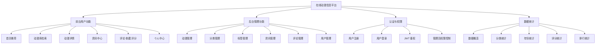
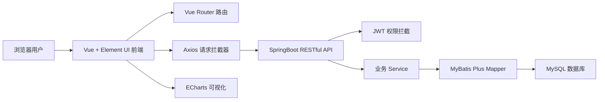

# 系统结构图

## 系统功能结构图

## 系统技术架构图

## 答辩演示流程建议

1. 首页展示真实动漫横幅、热门作品、分类和资讯。
2. 动漫库演示分类、标签、年份、关键词组合筛选。
3. 动漫详情演示评论、收藏、评分和正版入口。
4. 普通用户进入个人中心查看互动记录。
5. 管理员进入后台统计看板查看 ECharts 图表。
6. 管理员演示动漫、分类、标签、资讯、评论和用户管理。
